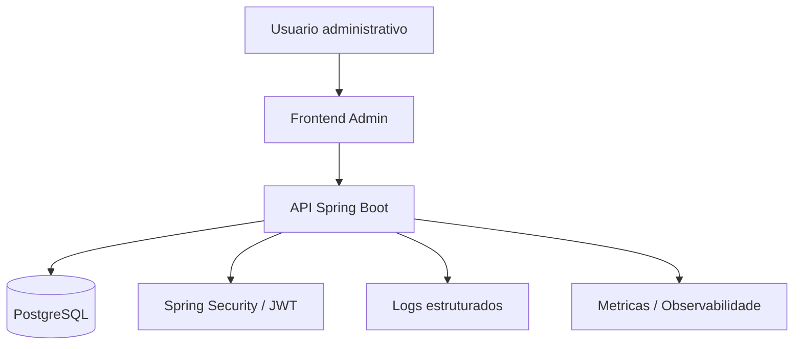
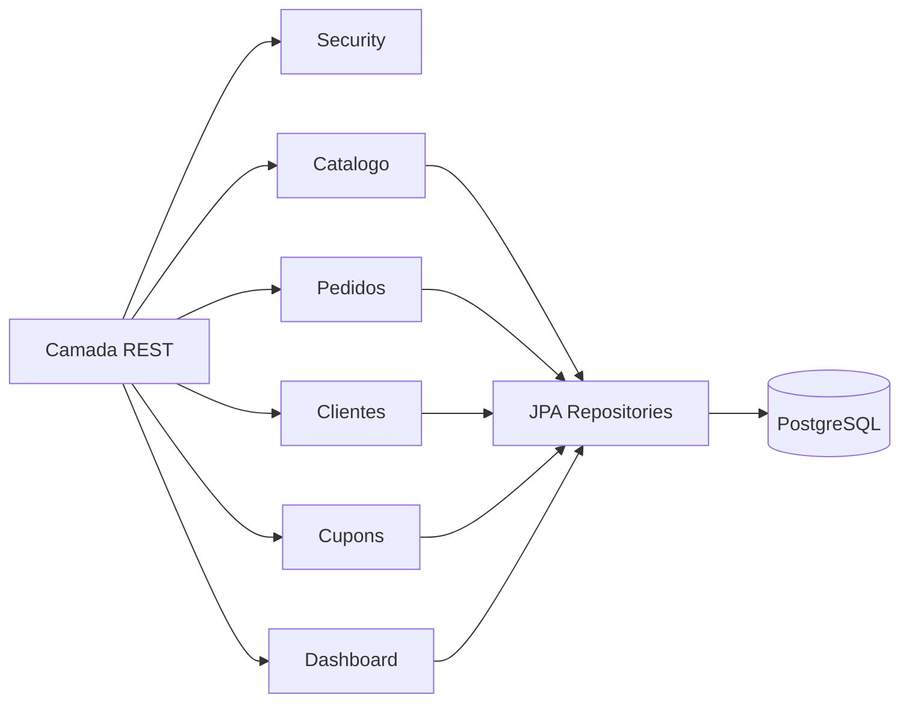

# CommerceOps Admin

Painel administrativo para e-commerce, pensado como um sistema interno para operacao, atendimento, catalogo, pedidos e acompanhamento de vendas.

## Objetivo

Construir uma aplicacao administrativa completa para gerenciar uma loja online, com foco em:

- visao geral de vendas, pedidos e estoque;
- CRUD de produtos, categorias, clientes e cupons;
- gestao de pedidos e status de entrega;
- autenticacao e autorizacao por perfis;
- API REST em Spring Boot;
- persistencia com PostgreSQL e JPA;
- logs estruturados, metricas e rastreabilidade;
- base preparada para evoluir para microsservicos, se necessario.

## Escopo Inicial

### Dashboard

- resumo de faturamento;
- pedidos recentes;
- produtos com baixo estoque;
- total de clientes;
- conversao por periodo;
- indicadores de cancelamento, reembolso e ticket medio.

### Catalogo

- cadastro, edicao, listagem e remocao logica de produtos;
- categorias e subcategorias;
- precos, imagens, descricao, SKU e estoque;
- status do produto: ativo, inativo, rascunho ou esgotado;
- filtros por categoria, status, preco e estoque.

### Pedidos

- listagem de pedidos;
- detalhamento do pedido;
- mudanca de status;
- historico de alteracoes;
- associacao com cliente, itens, pagamento e entrega;
- cancelamento e reembolso, se aplicavel.

### Clientes

- cadastro e consulta de clientes;
- historico de compras;
- dados de contato;
- status do cliente;
- observacoes internas.

### Cupons

- criacao de cupons promocionais;
- regras de desconto por valor fixo ou percentual;
- validade;
- limite de uso;
- status ativo/inativo.

### Usuarios Administrativos

- login;
- perfis de acesso;
- trilha de auditoria;
- separacao entre administradores, operadores, suporte e leitura.

## Arquitetura Sugerida

Arquitetura inicial em monolito modular com Spring Boot.

Essa abordagem permite entregar rapido, manter a complexidade sob controle e ainda preservar limites claros entre dominios. Caso o projeto cresca, os modulos podem ser extraidos futuramente para servicos separados.

### Backend

- Java 21;
- Spring Boot;
- Spring Web;
- Spring Data JPA;
- Spring Security;
- Bean Validation;
- PostgreSQL;
- Flyway para versionamento de banco;
- OpenAPI/Swagger para documentacao da API;
- Testcontainers para testes de integracao.

### Frontend

Opcoes recomendadas:

- React com TypeScript, se a prioridade for uma interface rica e moderna;
- Angular, se a equipe preferir um framework mais opinativo;
- Thymeleaf apenas se o objetivo for simplicidade extrema e menor separacao entre frontend e backend.

Para um painel administrativo real, a recomendacao principal e React + TypeScript.

### Banco de Dados

PostgreSQL como banco principal.

Entidades iniciais:

- User;
- Role;
- Product;
- Category;
- Customer;
- Order;
- OrderItem;
- Coupon;
- InventoryMovement;
- AuditLog.

## Diagrama de Contexto



## Diagrama de Modulos



## Estrutura Inicial do Backend

```text
src/main/java/com/commerceops/admin
├── CommerceOpsAdminApplication.java
├── config
├── security
├── common
│   ├── exception
│   ├── validation
│   └── pagination
├── catalog
│   ├── controller
│   ├── service
│   ├── repository
│   ├── entity
│   └── dto
├── orders
├── customers
├── coupons
├── dashboard
└── audit
```

## Padroes de API

- usar DTOs para entrada e saida;
- nao expor entidades JPA diretamente;
- validar entrada com Bean Validation;
- padronizar erros em formato unico;
- usar paginacao em listagens;
- usar filtros via query params;
- retornar codigos HTTP coerentes;
- documentar endpoints com OpenAPI.

Exemplo de endpoints:

```text
GET    /api/products
POST   /api/products
GET    /api/products/{id}
PUT    /api/products/{id}
DELETE /api/products/{id}

GET    /api/orders
GET    /api/orders/{id}
PATCH  /api/orders/{id}/status

GET    /api/dashboard/summary
```

## Seguranca

### Autenticacao

- login com email e senha;
- senha armazenada com hash forte, como BCrypt;
- JWT ou sessao server-side, dependendo do modelo de frontend;
- refresh token se houver SPA separada.

### Autorizacao

Perfis sugeridos:

- ADMIN: acesso total;
- MANAGER: gestao operacional;
- SUPPORT: consulta de clientes e pedidos;
- CATALOG: gestao de produtos e categorias;
- READ_ONLY: apenas leitura.

### Boas Praticas

- nunca retornar senha ou hashes em respostas;
- aplicar CORS restritivo;
- validar dados no backend mesmo que o frontend valide;
- proteger endpoints administrativos por role;
- registrar acoes sensiveis em auditoria;
- usar rate limit em login;
- preparar politica para LGPD, principalmente em dados de clientes.

## Observabilidade

### Logs Estruturados

Usar logs em JSON nos ambientes de homologacao e producao.

Campos recomendados:

- timestamp;
- level;
- service;
- traceId;
- spanId;
- userId;
- requestId;
- method;
- path;
- status;
- durationMs;
- message.

### Metricas

Com Spring Boot Actuator + Micrometer:

- latencia por endpoint;
- taxa de erro;
- quantidade de pedidos criados;
- pedidos por status;
- produtos com baixo estoque;
- tentativas de login;
- uso de CPU, memoria e conexoes do banco.

### Tracing

Preparar integracao com OpenTelemetry para rastrear chamadas entre frontend, backend, banco e servicos externos.

## Pipeline de Desenvolvimento

### Fluxo Git

- branch `main` sempre estavel;
- branches curtas por feature;
- pull requests obrigatorios;
- revisao de codigo antes do merge;
- convencao de commits, se fizer sentido para o time.

### CI

Etapas sugeridas:

1. checkout do codigo;
2. setup do Java;
3. cache do Maven/Gradle;
4. lint e formatacao;
5. testes unitarios;
6. testes de integracao com Testcontainers;
7. build da aplicacao;
8. analise estatica;
9. geracao de imagem Docker.

### CD

Para ambientes:

- dev: deploy automatico a cada merge;
- staging: deploy automatico com testes de smoke;
- producao: deploy manual aprovado.

## Testes

### Backend

- testes unitarios para services;
- testes de repository com banco real via Testcontainers;
- testes de controller com MockMvc;
- testes de seguranca para roles;
- testes de validacao de DTOs;
- testes de migracao com Flyway.

### Frontend

- testes de componentes;
- testes de formularios;
- testes de fluxos principais com Playwright;
- validacao visual basica para telas criticas.

## Ambientes

### Desenvolvimento Local

Servicos recomendados via Docker Compose:

- PostgreSQL;
- backend Spring Boot;
- frontend;
- observabilidade local opcional.

### Homologacao

- banco separado;
- dados mascarados;
- logs e metricas ativos;
- integracao com pipeline.

### Producao

- secrets fora do repositorio;
- backups;
- monitoramento;
- alertas;
- deploy rastreavel por versao.

## Roadmap

### Fase 1 - Base

- criar projeto Spring Boot;
- configurar PostgreSQL;
- configurar Flyway;
- criar autenticacao;
- criar CRUD de produtos e categorias;
- documentar API.

### Fase 2 - Operacao

- clientes;
- pedidos;
- status de pedidos;
- dashboard inicial;
- auditoria.

### Fase 3 - Qualidade

- logs estruturados;
- metricas;
- testes de integracao;
- pipeline CI;
- Docker Compose.

### Fase 4 - Frontend

- layout administrativo;
- tela de login;
- dashboard;
- CRUD de catalogo;
- gestao de pedidos;
- controle de permissoes por perfil.

### Fase 5 - Evolucao

- cupons avancados;
- relatorios;
- notificacoes;
- integracoes com pagamento e entrega;
- trilhas de auditoria mais completas;
- OpenTelemetry.

## Decisoes Recomendadas

- Comecar com monolito modular, nao microsservicos.
- Usar PostgreSQL desde o inicio.
- Usar Flyway para evitar banco sem historico.
- Usar DTOs e validacao desde a primeira feature.
- Usar logs estruturados cedo, mesmo que simples.
- Testar regras de negocio antes de investir em muitos testes de interface.
- Manter a UI do admin objetiva, densa e clara, com foco em operacao.

## Proximos Passos

1. Criar o projeto Spring Boot base.
2. Definir stack do frontend.
3. Criar `docker-compose.yml` com PostgreSQL.
4. Modelar as primeiras entidades.
5. Implementar autenticacao.
6. Criar o CRUD de produtos como primeira vertical completa.
